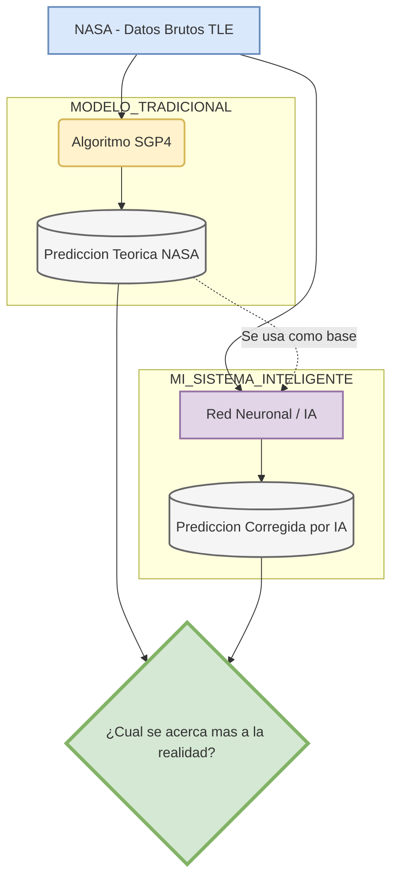

# tfg-sistema-localizacion-iss
Repositorio para el Trabajo de Fin de Grado: Sistema de localización de la Estación Espacial Internacional. Documentación, scripts, resultados y recursos.

### Objetivo del TFG: Corrección del Error Predictivo Orbital (NASA vs IA)



## Validacion SGP4 vs IA

La fase nueva del proyecto compara una prediccion SGP4 basada en TLE contra la
efemeride OEM oficial de NASA Spot the Station. La IA se usa como corrector del
residuo entre ambas trayectorias.

Flujo principal:

```bash
python scripts/ejecutar_validacion_oem.py
```

Documentacion: `docs/validacion_sgp4_vs_ia.md`
