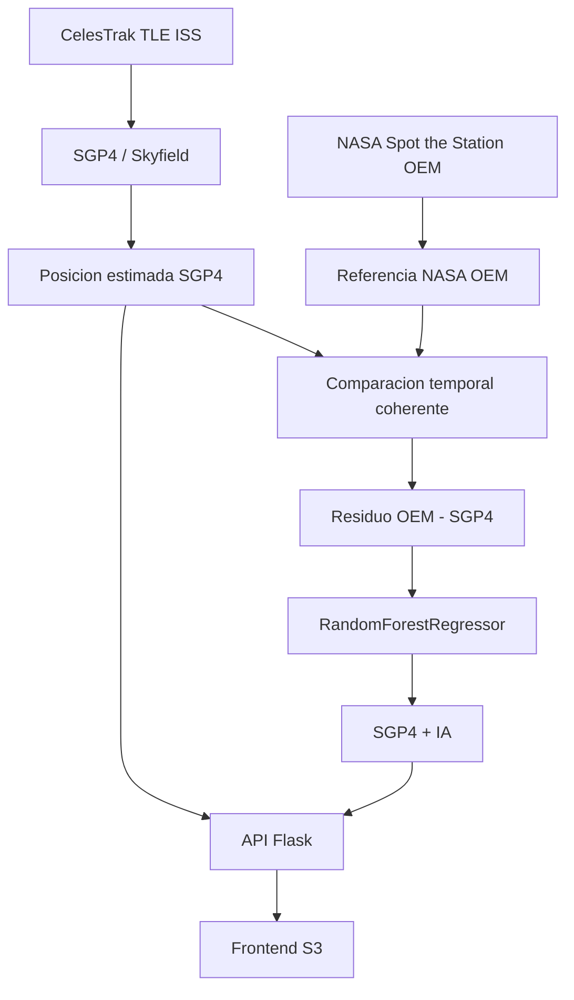

# tfg-sistema-localizacion-iss

Repositorio del Trabajo de Fin de Grado: **Sistema inteligente de localizacion
y validacion orbital de la Estacion Espacial Internacional mediante SGP4, datos
NASA OEM e inteligencia artificial**.

El proyecto calcula una trayectoria estimada de la ISS con TLE + SGP4, la
compara con la efemeride oficial NASA OEM y entrena un modelo de IA para aprender
el residuo entre ambas trayectorias.

## Demos desplegadas

### Demo dinamica en AWS

Frontend desplegado en AWS S3:

```text
http://tfg-iss-ia-richante-812206147937-us-east-1-an.s3-website-us-east-1.amazonaws.com/?api=http://3.81.172.135
```

Backend Flask desplegado en AWS EC2:

```text
http://3.81.172.135/api/estado
```

> Nota: el despliegue se ha realizado en AWS Academy Learner Lab. Si se reinicia
> el laboratorio, la IP publica de EC2 puede cambiar. En ese caso, el frontend
> permite indicar la nueva API con el parametro `?api=http://NUEVA_IP_PUBLICA`.

### Demo estatica sin backend

Como alternativa estable para el periodo de evaluacion, el repositorio incluye
una demo estatica con resultados ya generados. Esta version no necesita EC2 ni
API Flask activa, por lo que puede publicarse en GitHub Pages o en un bucket S3
estatico y seguir funcionando aunque el laboratorio de AWS Academy este apagado.

La carpeta preparada para GitHub Pages es:

```text
docs/
```

Cuando GitHub Pages este activado sobre la carpeta `docs/` de la rama `main`, la
demo estatica estara disponible en:

```text
https://richante.github.io/tfg-sistema-localizacion-iss/
```

## Idea tecnica

La IA no sustituye al modelo orbital SGP4. El sistema usa SGP4 como base fisica
y entrena un modelo de aprendizaje automatico para corregir el residuo frente a
la referencia NASA OEM:

```text
residuo = posicion_NASA_OEM - posicion_SGP4
posicion_corregida = posicion_SGP4 + residuo_predicho_por_IA
```

Flujo general:


```mermaid
graph TD
    A[CelesTrak TLE ISS] --> B[SGP4 / Skyfield]
    B --> C[Posicion estimada SGP4]

    D[NASA Spot the Station OEM] --> E[Referencia NASA OEM]

    C --> F[Comparacion temporal coherente]
    E --> F
    F --> G[Residuo OEM - SGP4]
    G --> H[RandomForestRegressor]
    H --> I[SGP4 + IA]

    C --> J[API Flask]
    I --> J
    J --> K[Frontend S3]
```

## Fuentes de datos

- **NASA Spot the Station / ISS Trajectory Data**: fuente oficial de la
  efemeride NASA OEM usada como referencia externa.
- **CelesTrak**: fuente publica especializada para obtener el TLE actualizado de
  la ISS, necesario para propagar la orbita con SGP4.
- **Datos generados por el sistema**: CSV/JSON producidos por los scripts de
  comparacion, entrenamiento y visualizacion.

## Estructura del repositorio

```text
app.py                         Backend Flask con endpoints JSON
frontend/                      Interfaz web estatica HTML/CSS/JS
scripts/                       Descarga, comparacion, entrenamiento y exportacion
data/                          Datos TLE, OEM y datasets generados
results/                       Resultados de evaluacion y graficas
models/                        Modelo entrenado en formato joblib
docs/                          Documentacion tecnica del proyecto
tests/                         Pruebas automatizadas
```

## Ejecucion principal

Desde la raiz del repositorio:

```bash
python -m venv .venv
source .venv/bin/activate
pip install -r requirements.txt
python scripts/ejecutar_validacion_oem.py
```

El flujo descarga el TLE actual, descarga el OEM de NASA, filtra el OEM a una
ventana temporal cercana a la epoca del TLE, compara SGP4 contra NASA OEM y
entrena el corrector IA.

## Preparar datos del frontend

Para regenerar el JSON de trayectoria usado por el mapa:

```bash
cp data/iss_tle_actual.txt data/iss_tle.txt
python scripts/generar_dataset_24h.py
python scripts/exportar_web.py
```

Para regenerar la demo estatica usada por GitHub Pages:

```bash
python scripts/exportar_demo_estatica.py
```

Este comando crea los JSON en `frontend/static/` y copia el frontend completo a
`docs/`, manteniendo la documentacion existente.

## Backend local

El backend lee los CSV/JSON generados y expone la informacion al frontend:

```bash
sudo .venv/bin/python app.py
```

Endpoints principales:

```text
/api/estado
/api/trayectoria
/api/resultados
/api/trayectorias-comparadas
```

## Frontend local o S3

El frontend esta en la carpeta `frontend/`. Puede abrirse como sitio estatico y
apuntar al backend mediante el parametro `api`:

```text
frontend/index.html?api=http://IP_BACKEND
```

En AWS, los archivos `index.html`, `style.css` y `app.js` se publican en un
bucket S3 configurado como sitio web estatico.

Si se abre sin el parametro `api`, el frontend usa automaticamente los archivos
estaticos de `static/`:

```text
frontend/index.html
docs/index.html
```

## Validacion y resultados

La validacion compara dos escenarios:

- **Prediccion futura corta**: entrena con la primera parte de la ventana
  temporal y prueba con un tramo posterior cercano.
- **Calibracion con NASA OEM**: entrena con puntos intercalados de la ventana
  OEM y prueba con otros puntos cercanos no usados directamente para entrenar.

La salida principal se genera en:

```text
data/comparacion_sgp4_oem.csv
results/evaluacion_corrector_ia_temporal.csv
results/evaluacion_corrector_ia_calibracion.csv
models/modelo_corrector_sgp4_oem.joblib
```

## Pruebas

```bash
python -m pytest -q
```

## Documentacion

La explicacion detallada de la validacion SGP4 vs IA se encuentra en:

```text
docs/validacion_sgp4_vs_ia.md
```
